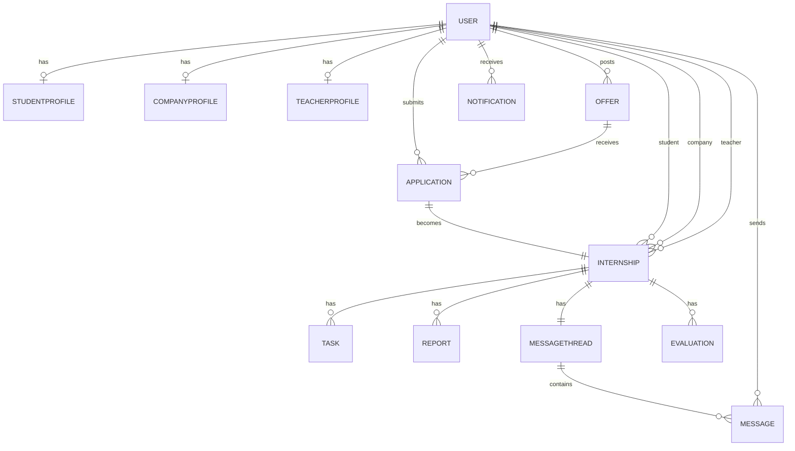
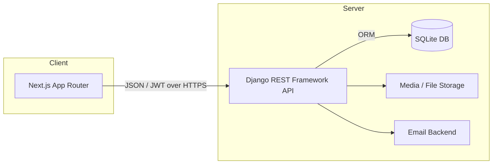
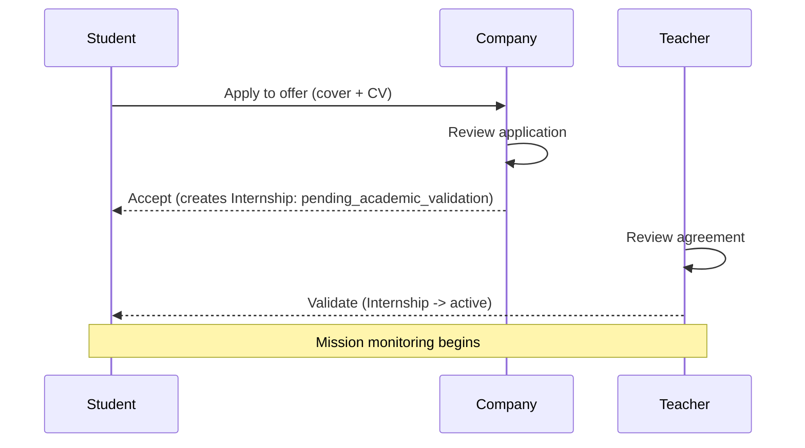
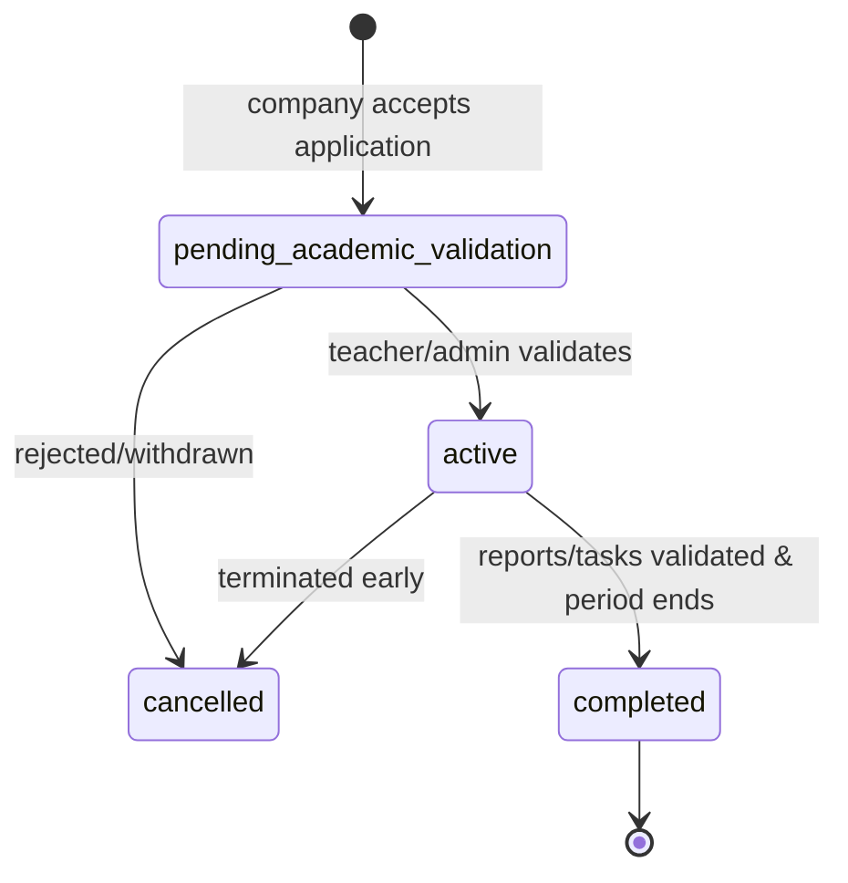

# Software Requirements Specification (SRS)
## Internship Management & Student Monitoring Platform

**Project type:** Tutored project (Bachelor's degree)
**Version:** 1.0
**Status:** Draft for development

---

## Table of Contents

1. [Introduction](#1-introduction)
2. [Overall Description](#2-overall-description)
3. [System Roles & Permissions](#3-system-roles--permissions)
4. [Functional Requirements](#4-functional-requirements)
5. [External Interface Requirements](#5-external-interface-requirements)
6. [Non-Functional Requirements](#6-non-functional-requirements)
7. [Data Model](#7-data-model)
8. [REST API Design](#8-rest-api-design)
9. [System Architecture](#9-system-architecture)
10. [Workflows](#10-workflows)
11. [Constraints, Assumptions & Risks](#11-constraints-assumptions--risks)
12. [Deliverables & Acceptance Criteria](#12-deliverables--acceptance-criteria)
13. [Glossary](#13-glossary)

---

## 1. Introduction

### 1.1 Purpose
This document specifies the requirements for a web platform that digitises the full internship lifecycle: account management, internship offer publication, application and validation, internship (mission) monitoring through reports and tasks, integrated messaging, and evaluation/rating. It is the reference for design, implementation, testing, and acceptance of the system.

### 1.2 Scope
The platform replaces the manual handling of internship steps, agreements, mission monitoring, supervision, and evaluation. It connects three primary actors — **students**, **companies**, and **teachers (academic supervisors)** — under the oversight of an **administrator**.

The system will:
- Allow account creation and authentication for each role.
- Allow companies to post and manage internship offers.
- Allow students to apply and companies/teachers to validate applications.
- Track the internship mission via tasks, periodic reports, and validation steps.
- Provide integrated messaging between participants.
- Support evaluation and rating of internships.

Out of scope for v1.0 (documented as future work): payroll/financial processing, video conferencing, mobile native apps, automatic CV parsing.

### 1.3 Definitions, Acronyms, Abbreviations
See the [Glossary](#13-glossary).

### 1.4 References
- IEEE 830 (SRS structure, used as a guide).
- Django REST Framework documentation.
- Next.js (App Router) documentation.

### 1.5 Overview
Section 2 gives the high-level description; Section 3 defines roles; Section 4 lists functional requirements with IDs; Sections 5–6 cover interfaces and non-functional requirements; Sections 7–9 specify the data model, API, and architecture; Section 10 describes the main workflows; Sections 11–12 cover constraints and deliverables.

---

## 2. Overall Description

### 2.1 Product Perspective
A new, self-contained web application built as two cooperating parts:
- A **Django REST Framework** backend exposing a JSON REST API.
- A **Next.js** frontend (App Router) consuming that API.
- A **SQLite** database (Django default) for development and for the scope of this tutored project.

### 2.2 Product Functions (summary)
- User registration, authentication, and profile management for four roles.
- Internship offer publication, search, and management.
- Application submission, review, and multi-step validation.
- Internship agreement (convention) generation and tracking.
- Mission monitoring: assignable tasks, periodic reports, validation.
- Internal messaging (one-to-one threads tied to an internship).
- Evaluation and rating at the end of the internship.
- Administrative oversight (user management, moderation, statistics).

### 2.3 User Classes and Characteristics
- **Student** — searches and applies for offers, performs the internship, submits reports and completes tasks, messages supervisors, views evaluations.
- **Company** — represents an organisation; posts offers, reviews applications, supervises interns, validates reports/tasks, evaluates students.
- **Teacher (academic supervisor)** — validates internship agreements, monitors assigned students, validates reports, evaluates, communicates with students and companies.
- **Admin** — manages accounts, moderates offers, resolves issues, views platform statistics.

### 2.4 Operating Environment
- Modern web browsers (Chrome, Firefox, Edge, Safari — current versions).
- Backend runs on Python 3.11+ with Django and DRF.
- Frontend runs on Node.js 18+ with Next.js.
- Development database: SQLite. (Production would typically migrate to PostgreSQL/MySQL — see [11. Constraints](#11-constraints-assumptions--risks).)

### 2.5 Design and Implementation Constraints
- REST API only (no GraphQL) for v1.0.
- Stateless authentication using JWT.
- The frontend and backend are deployed and versioned separately.
- All datetimes stored in UTC; displayed in the user's locale.

### 2.6 Assumptions and Dependencies
- Users have internet access and a supported browser.
- Email delivery is available for notifications (can be console backend in development).
- One company account may have one or more company users; for v1.0 a company is represented by a single company user account (extensible later).

---

## 3. System Roles & Permissions

| Capability | Student | Company | Teacher | Admin |
|---|:---:|:---:|:---:|:---:|
| Register / manage own profile | ✓ | ✓ | ✓ | ✓ |
| Post / edit / close internship offers | – | ✓ | – | ✓ |
| Browse / search offers | ✓ | ✓ | ✓ | ✓ |
| Apply to an offer | ✓ | – | – | – |
| Review applications | – | ✓ | view | ✓ |
| Validate application (company step) | – | ✓ | – | ✓ |
| Validate agreement (academic step) | – | – | ✓ | ✓ |
| Create / assign tasks | – | ✓ | ✓ | – |
| Submit reports / complete tasks | ✓ | – | – | – |
| Validate reports / tasks | – | ✓ | ✓ | – |
| Send / receive messages | ✓ | ✓ | ✓ | ✓ |
| Submit evaluation / rating | – | ✓ | ✓ | – |
| Manage all users & moderate content | – | – | – | ✓ |
| View platform statistics | own | own | assigned | all |

Permissions are enforced server-side via DRF permission classes; the frontend hides unavailable actions but never relies on hiding alone for security.

---

## 4. Functional Requirements

Requirements are grouped by module. Each has a unique ID, a priority (**M**ust / **S**hould / **C**ould), and acceptance notes.

### 4.1 Authentication & Accounts (AUTH)

| ID | Requirement | Priority |
|---|---|:---:|
| AUTH-01 | A visitor can register an account choosing one role: student, company, or teacher. Admin accounts are created only by another admin. | M |
| AUTH-02 | Registration captures role-specific fields (see [Data Model](#7-data-model)) and validates email uniqueness and password strength. | M |
| AUTH-03 | A registered user can log in with email + password and receive a JWT access token and refresh token. | M |
| AUTH-04 | A user can refresh an expired access token using a valid refresh token. | M |
| AUTH-05 | A user can log out (client discards tokens; refresh token can be blacklisted). | S |
| AUTH-06 | A user can request a password reset by email and set a new password via a tokenised link. | S |
| AUTH-07 | A user can view and edit their own profile; teachers and companies have extended profile fields. | M |
| AUTH-08 | New accounts may require admin/teacher activation before applying or posting (configurable; default: active on registration with email verification). | C |

**Acceptance:** Each role can complete registration → login → access a role-appropriate dashboard. Tokens expire and refresh correctly. Unauthorized API access returns 401/403.

### 4.2 Internship Offers (OFFER)

| ID | Requirement | Priority |
|---|---|:---:|
| OFFER-01 | A company can create an internship offer with title, description, required skills, location, duration, start date, number of positions, and status (draft/published/closed). | M |
| OFFER-02 | A company can edit, publish, unpublish, and close its own offers. | M |
| OFFER-03 | All authenticated users can browse published offers with pagination. | M |
| OFFER-04 | Offers are searchable and filterable (keyword, location, duration, skills, company). | S |
| OFFER-05 | A closed or filled offer no longer accepts applications. | M |
| OFFER-06 | An admin can moderate (hide/remove) any offer that violates policy. | S |

**Acceptance:** A company creates and publishes an offer; a student sees it in the listing and can open its detail page; filters narrow results correctly.

### 4.3 Applications & Validation (APP)

| ID | Requirement | Priority |
|---|---|:---:|
| APP-01 | A student can apply to a published offer with a cover message and an attached CV (file upload). | M |
| APP-02 | A student cannot apply twice to the same offer; can withdraw a pending application. | M |
| APP-03 | A company can view, accept, or reject applications to its offers, with an optional message. | M |
| APP-04 | When a company accepts an application, an **internship agreement (convention)** record is created in `pending_academic_validation` status. | M |
| APP-05 | The student's assigned teacher (or an admin) validates the agreement; only then does the internship become `active`. | M |
| APP-06 | All parties are notified (in-app + email) at each status change. | S |
| APP-07 | An application's status timeline is visible to the student. | S |

**Acceptance:** Student applies → company accepts → agreement created → teacher validates → internship becomes active. Each status transition is recorded and reflected in the UI.

### 4.4 Internship / Mission Monitoring (MON)

| ID | Requirement | Priority |
|---|---|:---:|
| MON-01 | Each active internship has a dashboard showing parties, dates, status, tasks, and reports. | M |
| MON-02 | A company or teacher can create tasks for the internship with a title, description, and due date. | M |
| MON-03 | A student can mark a task as submitted/done and attach a file or note. | M |
| MON-04 | A company or teacher can validate or request changes on a submitted task. | M |
| MON-05 | A student can submit periodic reports (e.g., weekly/monthly) with text and optional file attachment. | M |
| MON-06 | A company or teacher can validate a report or return it with feedback. | M |
| MON-07 | The internship can be transitioned to `completed` once required reports/tasks are validated and the period ends. | S |
| MON-08 | Progress indicators (e.g., % of validated tasks/reports) are displayed. | C |

**Acceptance:** A task and a report can be created, submitted, and validated; the internship dashboard reflects current state and progress.

### 4.5 Messaging (MSG)

| ID | Requirement | Priority |
|---|---|:---:|
| MSG-01 | Participants of an internship (student, company, teacher) can exchange messages within a thread tied to that internship. | M |
| MSG-02 | Messages display sender, timestamp, and read/unread state. | M |
| MSG-03 | A user sees a list of their conversations with unread counts. | S |
| MSG-04 | New messages trigger an in-app notification. | S |
| MSG-05 | (Optional) Real-time delivery via polling for v1.0; WebSockets/Channels as future work. | C |

**Acceptance:** Two participants of an internship can exchange messages and see them in order with correct read state.

### 4.6 Evaluation & Rating (EVAL)

| ID | Requirement | Priority |
|---|---|:---:|
| EVAL-01 | At/near internship completion, the company can submit an evaluation of the student (criteria scores + comment). | M |
| EVAL-02 | The teacher can submit an academic evaluation of the student. | M |
| EVAL-03 | (Optional) The student can rate the internship experience/company. | S |
| EVAL-04 | A final score/summary is computed and visible to authorised parties. | S |
| EVAL-05 | Evaluations are read-only once submitted (edit window configurable). | S |

**Acceptance:** Company and teacher each submit an evaluation; a combined summary is viewable by the student and admin.

### 4.7 Administration (ADMIN)

| ID | Requirement | Priority |
|---|---|:---:|
| ADMIN-01 | An admin can list, search, activate/deactivate, and delete user accounts. | M |
| ADMIN-02 | An admin can moderate offers and content. | S |
| ADMIN-03 | An admin can assign teachers to students (or this is set at registration). | S |
| ADMIN-04 | An admin can view platform statistics (counts of users, offers, applications, active internships). | C |

### 4.8 Notifications (NOTIF)

| ID | Requirement | Priority |
|---|---|:---:|
| NOTIF-01 | The system generates in-app notifications for key events (application status, validation, new message, new report/task). | S |
| NOTIF-02 | Email notifications mirror critical events (configurable). | C |

---

## 5. External Interface Requirements

### 5.1 User Interfaces
- Responsive web UI (desktop-first, usable on tablet/mobile).
- Role-based dashboards after login.
- Key screens: Login/Register, Offer listing & detail, Application form & tracker, Internship dashboard (tasks/reports), Messaging, Evaluation form, Admin panel.
- Consistent navigation, clear status badges, and accessible forms (labels, error messages).

### 5.2 Software Interfaces
- **Frontend ⇄ Backend:** JSON over HTTPS REST API (see [Section 8](#8-rest-api-design)).
- **Authentication:** JWT in the `Authorization: Bearer <token>` header.
- **Email:** SMTP (or Django console backend in development).
- **File storage:** Django media storage (local filesystem in development).

### 5.3 Communication Interfaces
- HTTPS for all traffic in production.
- CORS configured to allow the Next.js origin.

---

## 6. Non-Functional Requirements

| ID | Category | Requirement |
|---|---|---|
| NFR-01 | Performance | Typical API responses under 500 ms for standard list/detail requests with development data volumes. |
| NFR-02 | Scalability | Pagination on all list endpoints; queries indexed on foreign keys and filter fields. |
| NFR-03 | Security | Passwords hashed (Django default PBKDF2); JWT with short-lived access + refresh tokens; server-side role checks on every protected endpoint; input validation and file-type/size limits on uploads. |
| NFR-04 | Privacy | Users only access data they are party to; personal data minimised and access-controlled. |
| NFR-05 | Usability | Clear flows, inline validation, helpful empty states, and consistent feedback on actions. |
| NFR-06 | Reliability | Atomic transactions for multi-step state changes (e.g., accept application → create agreement). |
| NFR-07 | Maintainability | Modular Django apps; typed, componentised Next.js code; documented API; environment-based configuration. |
| NFR-08 | Portability | Database access via the Django ORM only, so SQLite can be swapped for PostgreSQL/MySQL with minimal change. |
| NFR-09 | Accessibility | Semantic HTML, keyboard navigation, sufficient colour contrast. |
| NFR-10 | Internationalisation | UTF-8 throughout; UI strings centralised to allow future translation. |

---

## 7. Data Model

> Note: `User` uses a custom Django user model with a `role` field. Role-specific data lives in profile tables linked one-to-one to `User`.

### 7.1 Entities (key fields)

**User** — `id`, `email` (unique, login), `password`, `first_name`, `last_name`, `role` (`student` | `company` | `teacher` | `admin`), `is_active`, `date_joined`.

**StudentProfile** — `user` (1:1), `school`, `program`, `level`, `phone`, `cv_file`, `assigned_teacher` (FK → User[teacher], nullable).

**CompanyProfile** — `user` (1:1), `company_name`, `sector`, `website`, `address`, `description`, `contact_phone`.

**TeacherProfile** — `user` (1:1), `department`, `title`, `phone`.

**Offer** — `id`, `company` (FK → User[company]), `title`, `description`, `skills`, `location`, `duration_weeks`, `start_date`, `positions`, `status` (`draft` | `published` | `closed`), `created_at`, `updated_at`.

**Application** — `id`, `offer` (FK), `student` (FK → User[student]), `cover_message`, `cv_file`, `status` (`pending` | `accepted` | `rejected` | `withdrawn`), `created_at`, `decided_at`. *Unique together: (offer, student).*

**Internship** (agreement / convention) — `id`, `application` (1:1 FK), `student` (FK), `company` (FK), `teacher` (FK, nullable), `status` (`pending_academic_validation` | `active` | `completed` | `cancelled`), `start_date`, `end_date`, `created_at`.

**Task** — `id`, `internship` (FK), `created_by` (FK → User), `title`, `description`, `due_date`, `status` (`open` | `submitted` | `validated` | `changes_requested`), `submission_note`, `submission_file`, `created_at`.

**Report** — `id`, `internship` (FK), `student` (FK), `title`, `content`, `file`, `period` (e.g., week/month label), `status` (`submitted` | `validated` | `changes_requested`), `feedback`, `created_at`.

**MessageThread** — `id`, `internship` (FK), `created_at`.

**Message** — `id`, `thread` (FK), `sender` (FK → User), `body`, `is_read`, `created_at`.

**Evaluation** — `id`, `internship` (FK), `evaluator` (FK → User), `evaluator_type` (`company` | `teacher` | `student`), `scores` (JSON of criterion→value), `comment`, `total_score`, `created_at`. *Unique together: (internship, evaluator_type).*

**Notification** — `id`, `user` (FK), `type`, `payload` (JSON), `is_read`, `created_at`.

### 7.2 Entity-Relationship Diagram



---

## 8. REST API Design

Base path: `/api/`. All protected endpoints require `Authorization: Bearer <access_token>`. Responses are JSON; list endpoints are paginated.

### 8.1 Authentication
| Method | Endpoint | Description |
|---|---|---|
| POST | `/api/auth/register/` | Register (role in body) |
| POST | `/api/auth/login/` | Obtain access + refresh tokens |
| POST | `/api/auth/refresh/` | Refresh access token |
| POST | `/api/auth/logout/` | Blacklist refresh token |
| POST | `/api/auth/password-reset/` | Request reset email |
| POST | `/api/auth/password-reset/confirm/` | Set new password |
| GET/PATCH | `/api/me/` | Get / update own profile |

### 8.2 Offers
| Method | Endpoint | Description |
|---|---|---|
| GET | `/api/offers/` | List published offers (filters: `q`, `location`, `duration`, `company`) |
| POST | `/api/offers/` | Create offer (company) |
| GET | `/api/offers/{id}/` | Offer detail |
| PATCH | `/api/offers/{id}/` | Update own offer (company) |
| POST | `/api/offers/{id}/publish/` | Publish |
| POST | `/api/offers/{id}/close/` | Close |
| DELETE | `/api/offers/{id}/` | Delete own offer (company/admin) |

### 8.3 Applications
| Method | Endpoint | Description |
|---|---|---|
| POST | `/api/offers/{id}/apply/` | Apply (student) |
| GET | `/api/applications/` | List own / received applications (role-scoped) |
| GET | `/api/applications/{id}/` | Detail |
| POST | `/api/applications/{id}/accept/` | Accept (company) → creates Internship |
| POST | `/api/applications/{id}/reject/` | Reject (company) |
| POST | `/api/applications/{id}/withdraw/` | Withdraw (student) |

### 8.4 Internships & Agreements
| Method | Endpoint | Description |
|---|---|---|
| GET | `/api/internships/` | List internships visible to the user |
| GET | `/api/internships/{id}/` | Internship dashboard data |
| POST | `/api/internships/{id}/validate/` | Academic validation (teacher/admin) → `active` |
| POST | `/api/internships/{id}/complete/` | Mark completed |

### 8.5 Tasks & Reports
| Method | Endpoint | Description |
|---|---|---|
| GET/POST | `/api/internships/{id}/tasks/` | List / create tasks |
| PATCH | `/api/tasks/{id}/` | Update / submit / validate |
| GET/POST | `/api/internships/{id}/reports/` | List / submit reports |
| PATCH | `/api/reports/{id}/` | Validate / request changes |

### 8.6 Messaging
| Method | Endpoint | Description |
|---|---|---|
| GET | `/api/threads/` | List user's threads |
| GET | `/api/threads/{id}/messages/` | List messages |
| POST | `/api/threads/{id}/messages/` | Send message |
| POST | `/api/messages/{id}/read/` | Mark read |

### 8.7 Evaluations
| Method | Endpoint | Description |
|---|---|---|
| GET/POST | `/api/internships/{id}/evaluations/` | List / submit evaluation |

### 8.8 Notifications & Admin
| Method | Endpoint | Description |
|---|---|---|
| GET | `/api/notifications/` | List own notifications |
| POST | `/api/notifications/{id}/read/` | Mark read |
| GET | `/api/admin/users/` | List/manage users (admin) |
| GET | `/api/admin/stats/` | Platform statistics (admin) |

---

## 9. System Architecture



- **Frontend (Next.js):** App Router with route-group layouts per role, server components for data display where possible, client components for interactive forms; central API client that attaches the JWT and handles token refresh; protected routes via middleware checking auth state.
- **Backend (Django + DRF):** Modular apps (`accounts`, `offers`, `applications`, `internships`, `messaging`, `evaluations`, `notifications`); DRF serializers, viewsets, and permission classes; JWT via `djangorestframework-simplejwt`.
- **Database (SQLite):** Accessed only via the ORM so it can be swapped later.

Suggested Django app layout:
```
backend/
  config/            # settings, urls, wsgi/asgi
  accounts/          # custom User + profiles + auth
  offers/
  applications/
  internships/       # agreement, tasks, reports
  messaging/
  evaluations/
  notifications/
```
Suggested Next.js layout:
```
frontend/
  app/
    (auth)/login, register
    (student)/...
    (company)/...
    (teacher)/...
    (admin)/...
  lib/api/           # fetch client, auth, types
  components/
```

---

## 10. Workflows

### 10.1 Application to active internship



### 10.2 Internship state machine



---

## 11. Constraints, Assumptions & Risks

- **SQLite suitability:** SQLite is fine for development and the scope of this tutored project (single-writer, low concurrency). It does not handle many simultaneous writers well and lacks some advanced features. Because all data access goes through the Django ORM, migrating to PostgreSQL/MySQL later requires only a settings change and re-running migrations. **Risk:** file uploads and concurrent writes during a live demo with many users could contend; mitigate by keeping demo load modest.
- **File uploads:** Stored on the local filesystem via Django media storage in development; validate file type and size.
- **Real-time messaging:** v1.0 uses request/response (optionally short polling). WebSockets (Django Channels) are future work.
- **Email:** Use the console backend in development; configure SMTP only for production/demo.
- **Security:** Never trust the client; enforce all permissions server-side. Keep JWT access tokens short-lived.

---

## 12. Deliverables & Acceptance Criteria

Mapping to the project's expected deliverables:

1. **Functional web application** — Next.js frontend + Django REST API + SQLite, covering all **Must** requirements in Section 4.
2. **Specifications & diagrams** — this SRS, including the ER diagram, architecture diagram, and workflow/state diagrams (Sections 7, 9, 10).
3. **Testing** — backend unit/API tests (DRF `APITestCase`) for auth, permissions, and key workflows; frontend tests for critical components; a documented manual test plan covering the end-to-end scenarios in Section 10.
4. **Deployment** — instructions to run backend and frontend (env vars, migrations, seed data) plus a deployment note for a hosted environment.
5. **Support** — README with setup, an API reference (the API can expose an auto-generated schema), and a short user guide per role.

**Overall acceptance:** All four roles can complete their core journeys end-to-end (register → login → offer/application/validation → monitoring with tasks & reports → messaging → evaluation), permissions are enforced, and the documented test scenarios pass.

---

## 13. Glossary

| Term | Meaning |
|---|---|
| **Internship agreement / convention** | The validated arrangement binding a student, company, and academic supervisor for an internship. |
| **Mission monitoring** | Ongoing supervision of the internship via tasks, reports, and validations. |
| **Academic supervisor** | The teacher responsible for validating and monitoring a student's internship. |
| **JWT** | JSON Web Token, used for stateless authentication. |
| **DRF** | Django REST Framework. |
| **ORM** | Object-Relational Mapper (Django's database abstraction layer). |
| **App Router** | Next.js routing system based on the `app/` directory. |

---

*End of SRS v1.0.*
